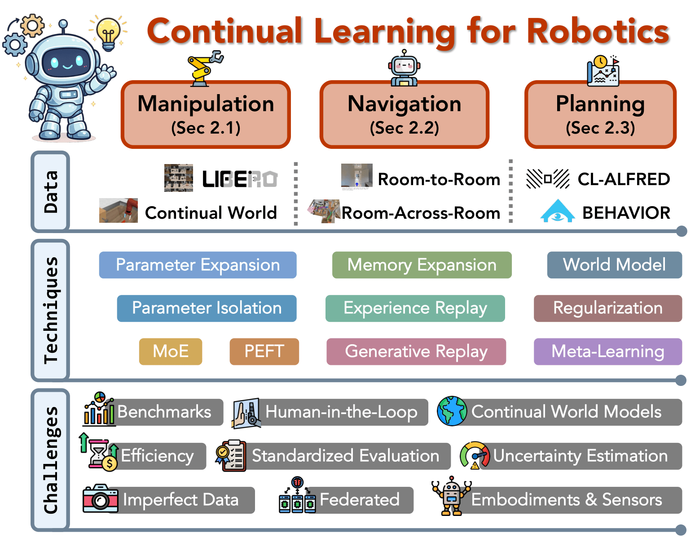

# Awesome Continual Learning in Robotics and Embodied AI
## 🔥🔥🔥 [A Survey of Continual Learning for Robotics in the Foundation Model Era](https://www.techrxiv.org/doi/full/10.36227/techrxiv.176972367.76460794/v1)

    

Coming Soon!!!
